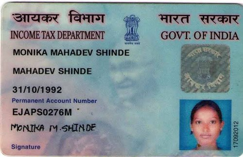
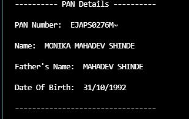

# PAN card OCR with pytesseract

It will read any pan card image and will generate PAN number, Name, Father's Name and DOB with the help of Opencv and Pytesseract.
 


## Requirements

pip install pillow

pip install ftfy

pip install io

pip install pytesseract

pip install numpy


  
## Run Locally

Clone the project

```bash
  git clone https://link-to-project
```

Go to the project directory

```bash
  cd PAN_card_OCR
```

Install dependencies

```bash
  install above packages
```

Run main file

```bash
  python main.py
```

  
## Screenshots
Query Image



Result Image




  
